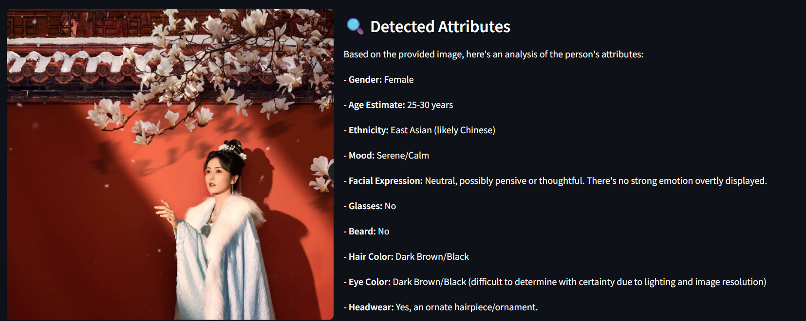

# 🤖 AI Human Attribute Detector

A web-based application that uses **Google Gemini AI** and **Streamlit** to analyze human facial attributes from an uploaded image. The app detects and displays details like age, gender, emotion, facial expression, and more.

---

## 🚀 Features

- Upload a **photo** and detect facial attributes using AI.
- Attributes detected:
  - Gender
  - Age estimate
  - Ethnicity
  - Mood & Emotions (with emoji)
  - Facial expression
  - Hair & eye color
  - Glasses / Beard / Headwear
  - Confidence level (with progress bar)
- 📘 Detailed explanation of each attribute
- 🌗 Light/Dark mode toggle for better viewing experience

---

## 🖼 Preview

| Upload Image          | AI Detection              |
| --------------------- | ------------------------- |
|  |  |

---

## ⚙️ Installation & Running

### 1. Clone the repository

```bash
git clone https://github.com/Jithmi25/human-attribute-detector.git
cd ai-human-attribute-detector
```
